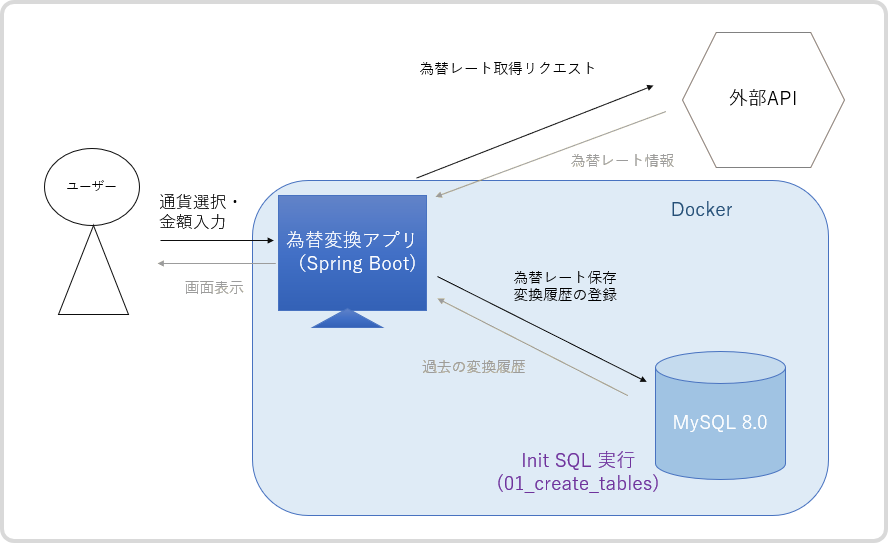
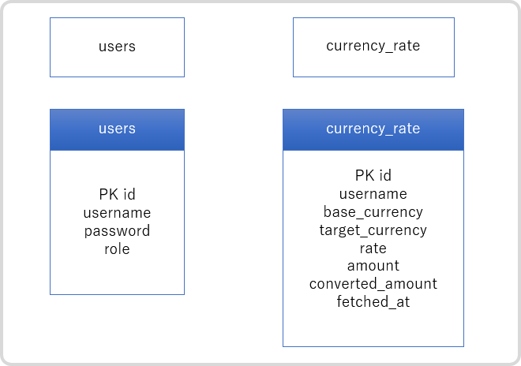
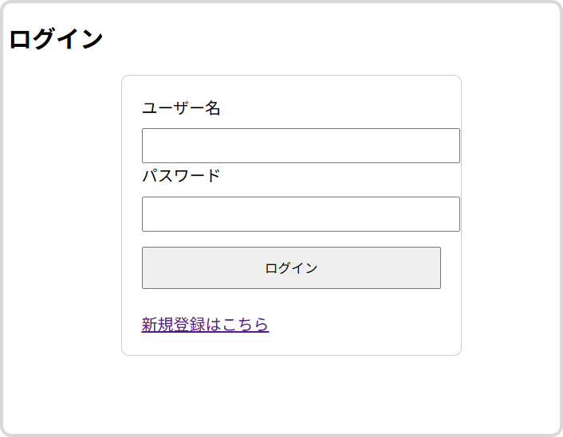
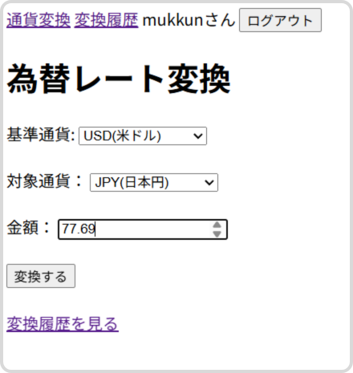
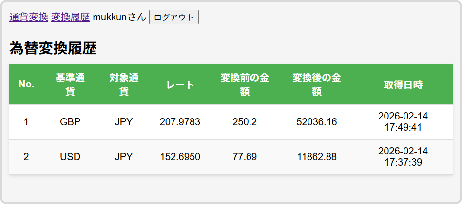

# 通貨変換アプリ（Spring Boot + MySQL + Docker）

外部 API から取得した通貨レートをユーザごとに保存し、最新レートを使って金額変換ができる Web アプリです。  
Spring Boot を中心に、認証・DB 設計・API連携・Docker による環境構築まで実装しています。
---

## 開発背景
Spring Boot の理解を深めるため、以下の要素を含む Web アプリを制作しました。

 - 認証機能 (Spring Security）
 - DB 永続化（Spring Data JPA）
 - 外部 API 連携
 - ユーザ単位でのデータ分離
 - Docker によるコンテナ環境構築
---

## 主な機能
 - ユーザー登録・ログイン（Spring Security）
 - 外部 API から通貨レート取得
 - レートの自動保存（ユーザーごと）
 - 1時間以内のﾚｰﾄは再取得しない設計
 - 金額変換（例：USD → JPY）
 - ユーザーごとのレート履歴表示
 ---
 
## 使用技術

| 分類 | 技術 |
| ------------ | ----------- |
| 言語 | Java 21 |
| フレームワーク | Spring Boot |
| 認証 | Spring Security |
| ORM | Spring Data JPA |
| DB | MySQL 8.0（Docker）|
| テンプレート | Thymeleaf |
| コンテナ | Docker |
---

## アーキテクチャ構成

本アプリは以下のレイヤー構造で実装しています：  
Controller → Service → Repository → MySQL  

### Docker 構成
 - `currency-app`（Spring Boot）
 - `currency-mysql`（MySQL 8.0）
 Docker Compose により、アプリと DB を同一ネットワークで接続。  
 
 コンテナ内では `localhost` ではなく **サービス名で接続する設計** を採用しています。
 
 
## 技術的な工夫
  
### ①  API 制限対策 

１時間以内に取得済みのレートが存在する場合は外部 API を呼ばす、DB の値を利用。  
→ API 使用回数削減 & パフォーマンス向上  

### ② ユーザ単位のデータ管理
認証ユーザ名をキーとして保存することで、ユーザごとのデータ分離を実現。

---
### ③ Docker 環境での問題解決
開発中に発生した問題：  
・Hibernate Dialect エラー  
・コンテナ内から`localhost`接続できない問題  
・Maven parent POM 解決エラー  
→ ログ解析・ネットワーク理解により解決しました。  
 
---


## アプリ全体構成図



### ER 図



## 画面キャプチャ

### ログイン画面
ユーザー名とパスワードでログインします。  


### 通貨変換画面
基準通貨・対象通貨・金額を入力して変換を行います。  


### レート履歴画面
ユーザごとに保存された変換履歴を一覧表示します。  


---

## セットアップ手順

### 1. リポジトリをクローン   
```bash
git clone https://github.com/Hazuki120/exchange.git
```

### 2. `.env`ファイル作成
```env
MYSQL_ROOT_PASSWORD=rootpass
MYSQL_DATABASE=exchange
MYSQL_USER=appuser
MYSQL_PASSWORD=apppass

SPRING_DATASOURCE_USERNAME=appuser
SPRING_DATASOURCE_PASSWORD=apppass

EXCHANGE_API_KEY=your_api_key
```
⚠ Windows の環境変数に同名キーがあると `.env` が無視されるので注意。  
### 3. Docker で MySQL を起動
#### 起動
```bash
docker compose up --build
```

### 4. アクセス方法
アプリ起動後、ブラウザで以下にアクセスしてください。  

http://localhost:8080  
#### 停止
```bash
docker compose down
```

## API エンドポイント一覧
| メソッド | パス | 説明 |
|----------|------|------|
| GET | /exchange | 通貨変換フォーム |
| GET | /exchange/result | 変換結果表示 |
| GET | /exchange/history | ユーザのレート履歴 |
| GET | /latest | 最新レート取得 |
| GET | /save | レート保存（内部用） |

## ディレクトリ構成
```text
src/  
 └─ main/  
     ├─ java/  
     │   └─ com/example/exchange/  
     │        ├─ application/  
     │        │    ├─ controller/  
     │        │    │    ├─ CurrencyController.java  
     │        │    │    ├─ HistoryController.java  
     │        │    │    ├─ LoginController.java  
     │        │    │    └─ SignUpController.java  
     │        │    └─ config/  
     │        │         └─ SecurityConfig.java  
     │        ├─ domain/  
     │        │    ├─ model/  
     │        │    │    ├─ CurrencyRate.java  
     │        │    │    └─ User.java  
     │        │    ├─ repository/  
     │        │    │    ├─ CurrencyRateRepository.java  
     │        │    │    └─ UserRepository.java  
     │        │    ├─ service/  
     │        │    │    ├─ CurrencyConversionService.java  
     │        │    │    ├─ CurrencyRateService.java  
     │        │    │    ├─ CustomUserDetailsService.java  
     │        │    │    └─ UserService.java  
     │        └─ infrastructure/  
     │             └─ CurrencyAppApplication.java  
     └─ resources/  
         ├─ static/  
         ├─ templates/  
         │    ├─ exchange.html  
         │    ├─ history.html  
         │    ├─ login.html  
         │    ├─ result.html  
         │    └─ signup.html  
         └─ application.properties  
```

## 今後の課題
 - API レート制限対策（キャッシュ強化）
 - グラフ表示（レート推移）
 - UI/UX 改善（Bootstrap 導入）
 - 管理者画面の追加
 
---
## このアプリで学んだこと
 - Spring Security の認証フロー理解
 - 外部 API 連携の実装方法
 - Docker による開発環境構築
 - コンテナ間通信の考え方
 
 

 
 
 